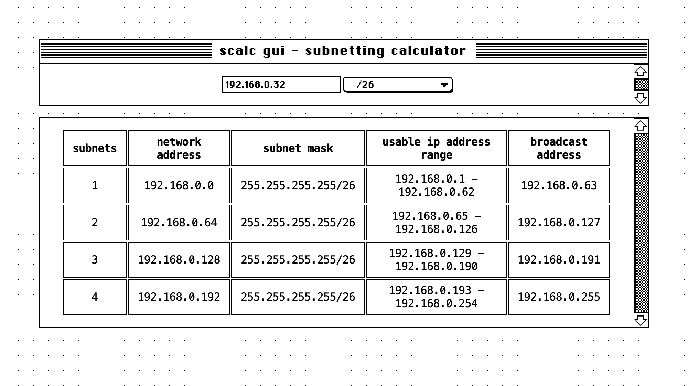

    <h1 align = "center">Scalc GUI - Written in Rust and Tauri</h1>

  Just a graphic version of the cli tool under the same name

 

    
## Current features:

## Planned features:

## Contribution
Feel free to create a pull request and add some new features or clean up the code, any help is appreciated.
